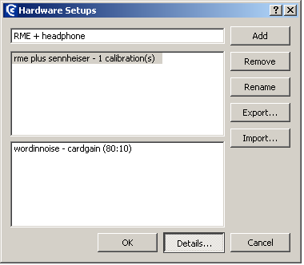

Creating experiment files
=========================

An Apex3 experiment file is an XML file. Like any XML file, it contains a root
element (`<apex/>`), which contains various main elements. The general structure
of an Apex3 experiment file could be as follows:

```xml
    <?xml version='1.0' encoding='UTF-8'?>
    <apex>
        <procedure xsi:type="apex:adaptiveProcedure">
            <parameters> ... </parameters>
            <trials> ... </trials>
        </procedure>

        <screens> ... </screens>
        <datablocks> ... </datablocks>
        <devices> ... </devices>
        <stimuli> ... </stimuli>
    </apex>
```

The main elements are listed in the next section. Subsequently, each
main element is discussed briefly.

Main APEX elements
------------------

Here we describe the main elements of the experiment, and the order in
which they should occur. Some of them are compulsory, some are optional,
and some contain child elements (see [basic concepts XML](../basicconcepts#xml)).
Only the first child element is given. A complete listing of all the elements is given in the
schema documentation.

-   Procedure see [Procedures](#procedures)

-   Corrector see [Procedures](#procedures)

-   Screen see [Screen](#screen)

-   Datablocks see [Datablocks](#datablocks)

-   Devices see [Devices](#devices)

-   Filters *optional* see [Filters](#filters)

-   Stimuli see [Stimuli](#stimuli)

-   Connections *optional* see [Connections](#connections)

-   Randomgenerators *optional* used to set parameters to random values, for example
    useful to implement level roving. An example of level roving is
    given in [Roving](../examplestrategies#roving)

-   Calibration *optional* see [Calibration](#calibration)

-   Results *optional* see [Results](#results) and [Using XSLT transforms](../resultanalysis#using xslt transforms)

-   Interactive *optional* see [Interactive](#interactive)

-   General *optional* see [General](#general)

In the next paragraphs these elements will be described in more detail
and their main child elements will be given.

### Declaration of Main element

To associate an experiment file with the correct name space and schema,
the following attributes are necessary:

```xml
    <apex:apex xmlns:xsi="http://www.w3.org/2001/XMLSchema-instance"
        xmlns:apex="http://med.kuleuven.be/exporl/apex/3.0.2/experiment">
    ...
    </apex:apex>
```

For more information on name spaces and schema declarations, we refer to
the XML specifications. For Apex3 it is sufficient to copy the text above.
Note that the namespace contains a version number, in the example 3.0.2.
When APEX opens an experiment file with a lower schema version number
than its own version number, it will attempt to upgrade the experiment
file to the new version. Any warnings or errors in the conversion
process will be shown in the message window. Alternatively, you can
manually upgrade the experiment file, by changing the version number,
and fixing the validation errors that OxygenXML may show. Alternatively,
you can use the apexupgrader tool in the Apex3 binaries folder. Drag your
experiment file on top of the apexupgrader tool to start the
conversation. Your upgraded file will have an ’.upgraded’ appended to
the original file name.

Although the abovementioned attributes are sufficient, one modification
can be useful. If you use an XML editor with schema support (to allow
autocompletion and showing documentation from the schema), it needs to
know where the Apex3 schema(`experiment.xsd`) is located. This can be indicated by adding an
absolute or relative path to the apex schema to the attribute. If for
example Apex3 is installed in the default location (`C:/Program Files/apex3`),
the result would be as
follows:

```xml
    <apex:apex xmlns:xsi="http://www.w3.org/2001/XMLSchema-instance"
     xmlns:apex="http://med.kuleuven.be/exporl/apex/3.1.1/experiment"
     xsi:schemaLocation="http://med.kuleuven.be/exporl/apex/3.1.1/experiment
     file:C:/Program\%20Files/apex3/schemas/experiment.xsd>"
    ...
    </apex:apex>
```

Or you could refer to the schema that we provide on our web server. This
has the advantage that you don’t have to refer to the absolute path on a
particular computer, but has the downside that it requires an internet
connection:

```xml
    <apex:apex xmlns:xsi="http://www.w3.org/2001/XMLSchema-instance"
     xmlns:apex="http://med.kuleuven.be/exporl/apex/3.1.1/experiment"
     xsi:schemaLocation="http://med.kuleuven.be/exporl/apex/3.1.1/experiment
     https://exporl.med.kuleuven.be/apex/schemas/3.1.1/experiment.xsd">
    ...
    </apex:apex>
```

### Procedures <a name="procedures"/>

The Procedure controls the flow of an experiment. It decides on the next
screen to be shown and the next stimulus to be presented. Generally a
procedure will make use of a list of predefined trials.

e.g.

```xml
    <procedure xsi:type="apex:constantProcedure">
        <parameters>
            ...
        </parameters>

        <trials>
            <trial id="trial1" >
                ...
            </trial>
            <trial id="trial2" >
                ...
            </trial>
        </trials>
    </procedure>
```

The attribute determines the type of procedure that will be used. There
are 5 procedure types implemented:

constantProcedure:

:   each trial is presented a specified number of times

adaptiveProcedure:

:   the dependent parameter? (e.g.: level) of the stimulus depends on
    the response of the subject

trainingProcedure:

:   a stimulus is presented AFTER the user has selected the trial by
    pressing a button on the screen. If no corresponding trial is found,
    an error message is shown. This procedure is designed to be used as
    a replacement for the constant procedure to allow subjects to
    perform training before starting the actual experiment

pluginProcedure:

:   allows the user to implement a custom procedure using ECMAScript,
    see section \[sec:plugins\].

multiProcedure:

:   contains several child procedures of any of the other 4 types and
    selects between them. This procedure ends when all child procedures
    have ended

Every contains the following elements:

-   specifies the workings of a procedure, e.g., specifies the number of
    presentations per trial. To know which parameters can be set for a
    certain procedure, it is easiest to consult the schema documentation
    or an example experiment file. Please also
    read section \[sec:Parameters\].

-   specifies each trial that can be presented. A trial consists of a
    screen to be shown, a stimulus to be presented and the
    correct response. Each of these can be defined here.

The procedure determines whether the experiment is completed.

One particular parameter for the procedure is the corrector. The
corrector compares the user’s response to the correct response and can
be used by the procedure to determine the next trial. The type of
corrector to be used is defined using the attribute. E.g.:

```xml
    <procedure xsi:type="apex:constantProcedure">
      <parameters>
       <presentations>2</presentations>
       <order>sequential</order>
       <corrector xsi:type="apex:isequal"/>
      </parameters>
      ...
    </procedure>
```

Two main Correctors exist:

-   compares whether the text defined in the element in and the result
    from the screen (the subject’s response) are exactly the same

-   this corrector is used together with in.

### Screen <a name="screen"/>

A screen is a GUI (Graphical User Interface) that is to be used by the
subject to respond to the stimulus that was presented. The layout of the
screen can be changed in different ways and a variety of elements can be
added to the screen, such as buttons, labels, pictures and movies (take
a look in the APEX reference manual for an exhaustive list of all
elements that can be added or changed). A brief overview of the possible
elements is given below.

```xml
<screens>
    <general>
    ...
    </general>
    <reinforcement>
    ...
    </reinforcement>
    <style_apex> ... </style_apex>
    <style> ... </style>
    <childmode>  ... </childmode>
    <defaultFont> ... </defaultFont>
    <defaultFontsize> ... </defaultFontsize>
    <screen id="screen1">
    ...
    </screen>
</screens>
```

-   Some general properties of the entire APEX window are set in this
    section, such as removing the panel on the right hand of the screen
    or adding a repeat button. The properties are applied for each
    particular screen defined below.

-   indicates whether a progress bar is shown and whether feedback is
    given, and defines what kind of feedback about the procedure and
    correctness of answers is shown to the user. This is valid for the
    whole experiment. includes:

    -   if the value is a progress bar will be displayed in the right
        hand bottom corner of the screen. The bar indicates how many
        trials have been completed and how many remain. When conducting
        an experiment in an adaptive way, it shows when a
        reversal occurs. The progress bar will increase at every
        reversal while the number of trials varies. The progress bar is
        not functional for multiprocedure or trainingprocedure.

    -   shows visual feedback according to the correctness of the
        last answer. Feedback is shown using an upward or downward
        pointing thumb in the right hand panel if the value is set to .
        No feedback is given if the value is .

    Other elements can be added to but are optional:

    -   duration of time after response (in msec) that APEX 3 waits
        before presenting the next trial. During this interval feedback
        can be displayed. If feedback is false, but a length is present,
        the specified time will be the time between two trials.

    -   When set to , the clicked screenelement is highlighted (i.e. the
        subject’s answer). The correct screenelement is highlighted
        (irrespective of the answer of the subject) if the value is set
        to . No highlighting occurs if the value is .

    -   and can be used to set a feedback picture different from the
        standard thumb up/down. A prefix for the filename has to
        be specified.

    -   When set to , the element corresponding to the currently playing
        stimulus is highlighted.

-   Style that has to be applied to the whole of Apex.

-   Style that has to be applied to all screens.

-   Defines the elements used in child mode. In , the experiments are
    adapted to the interest of children. It mainly involves a different
    screen panel and enables intro/outro movies.

-   and Name and size of the default font to be used for all elements of
    every screen.

-   a screen is defined for each stimulus. Each screen has an ID by
    which it can be referred to elsewhere in the experiment file (cf in
    procedure/trial to associate it with a stimulus).

### Datablocks <a name="datablocks"/>

A datablock is an abstraction of a basic block of data that can be
processed by Apex3 and can be sent to a matching device. In the case of a
sound card, the datablock would be an audio signal in the form of a
series of samples that is commonly stored on disk as a so-called wave
file.

```xml
    <datablocks>
        <uri_prefix>...</uri_prefix>
        <datablock id="datablock_star">
            <device>soundcard</device>
            <uri>star.wav</uri>
        </datablock>
    </datablocks>
```

Basically, in element , a wave file on disk is assigned an ID, such that
it can be referred to elsewhere in the experiment file.

-   indicates the path where APEX will look for the file, relative to
    the path where the experiment file is stored.
    See [Prefixes](#prefixes)

-   for each wave file a datablock is defined, with an ID.

### Devices <a name="devices"/>

A device is a system connected to the computer that can be controlled by Apex3
. Devices can send signals to a transducer. Examples are sound cards and
interfaces to . Device(s) can have parameters that can be controlled by Apex3
.

```xml
    <devices>
        <device id="soundcard" xsi:type="apex:wavDeviceType">
            <channels>2</channels>
            <gain>0</gain>
            <samplerate>44100</samplerate>
        </device>
    </devices>
```

The following device types are currently supported:

wavDeviceType

:   for sound cards

L34Type

:   for an interface to cochlear implants

### Filters <a name="filters"/>

Filters are used to process data before sending it to a device. For
example, if you want to change the level of your signal, you can use an
*amplifier*, which is a specific kind of filter.
However, not every experiment needs filters. If the signals are routed
directly to the output device without any processing, the section ```<filters/>``` can
be dropped.

Currently implemented filters are:

amplifier

:   a type of filter which allows to amplify or attenuate sound data

```xml
        <filter xsi:type="apex:amplifier" id="ampli">
```

generator

:   a special type of filter which generates a defined stimulus, such as
    a sine (SineGenerator) or white noise

```xml
        <filter xsi:type="apex:generator" id="SineGenerator">
          <type>sinus</type>
        </filter>
```

dataloop

:   : a type of filter which can loop a given datablock infinitely
    (continuous = ), and can jump randomly (randomjump = )

```xml
        <filter xsi:type="apex:dataloop" id="noisegen">
          <continuous>true</continuous}
          <datablock>noisedata</datablock}
          <randomjump>true</randomjump}
        </filter>
```

PluginFilter

:   a type of filter which is an interface for implementing custom
    filters (see [Examples](../examples)).

contains those elements which specify a filter or a generator

```xml
    <filter id="noisegen" xsi:type="apex:dataloop">
       <device>soundcard</device>
       <channels>1</channels>
       <continuous>false</continuous>
       <datablock>noisedata</datablock>
       <basegain>0</basegain>
       <gain>0</gain>
    </filter>
```

### Stimuli <a name="stimuli"/>

Stimuli are the auditory events presented to the subject. They can
consist of one or more datablocks that are routed to any number of
devices, simultaneously or sequentially.

```xml
    <stimuli>
      <fixed_parameters>
      ...
      </fixed_parameters>

      <stimulus id="stimulus_sentence1">
      ...
      </stimulus>
    </stimuli>
```

See [Parameters](#parameters) for a description of the element .

### Connections <a name="connections"/>

Connections are defined to connect Datablocks, Filters and Devices. Any
Datablock can be connected to any Filter or Device and any Filter can be
connected to any other Filter or Device.

```xml
      <connections>
        <connection>
         ...
        </connection>
      </connections>
```

defines how the different filters are routed to the output device(s)

APEX can visualise the connections by clicking on the “show stimulus
connections” item in the menu.

An example connection diagram


### Calibration <a name="calibration"/>

In order to present any given stimulus at a known sound pressure level,
a calibration gain is applied before the stimulus is played. Calibration
is the process of measuring which calibration gain is necessary for a
given stimulus to achieve a certain sound pressure level. Calibration
parameters are set in the element of the apx file. Here a ID and
parameters to be calibrated are defined. Since the stimuli used in most
experiments are short, it is often helpful to make a longer version of
the stimulus for use during calibration. This stimulus must have it’s
own and element definitions. e.g:

```xml
    <datablock id="datablock_tone">
        <device>wavdevice</device>
        <uri>tone.wav</uri>
    </datablock>

    <datablock id="datablock_tone_long_calibration">
                <device>wavdevice</device>
                <uri>tone_long_calibration.wav</uri>
    </datablock>

    <stimulus id="stimulus_tone">
        <datablocks>
        <sequential>
            <datablock id="datablock_tone"/>
        </sequential>
        </datablocks>
        <variableParameters></variableParameters>
        <fixedParameters></fixedParameters>
    </stimulus>

    <stimulus id="stimulus_tone_long_calibration">
                <datablocks>
                    <sequential>
                        <datablock id="datablock_tone_long_calibration "/>
                    </sequential>
                </datablocks>
                <variableParameters></variableParameters>
                <fixedParameters></fixedParameters>
            </stimulus>

    <calibration profile="Calibprofile_HIB">
            <stimuli>
                <stimulus id="stimulus_calibration_tone"/>
    <stimulus id="stimulus_calibration_noise"/>
            </stimuli>
            <parameters>
                <parameter id="gainid_amp_tone">
                    <targetamplitude>30</targetamplitude>
                    <calibrationamplitude>80</calibrationamplitude>
                    <mute>-150</mute>
                    <min>-100</min>
                    <max>100</max>
                </parameter>
                <parameter id="gainid_amp_noise">
                    <targetamplitude>15</targetamplitude>
                    <calibrationamplitude>80</calibrationamplitude>
                    <mute>-150</mute>
                    <min>-100</min>
                    <max>100</max>
                </parameter>
            </parameters>
        </calibration>
```

The parameter to be calibrated is usually a gain parameter for an
amplifier element. In the example there are two stimuli that need to be
calibrated. The stimuli have datablock ID’s and . Since the stimuli are
derived from different datablocks and different WAV files, they must be
calibrated separately. For this reason, the datablocks are connected to
separate amplifier elements with IDs and . In this example, these two
amplifier gain parameters are calibrated.

Calibration consists of a GUI for calibrating parameters and saving and
applying calibration results. Any stimulus defined in the experiment
files can be used as a calibration stimulus.

Typically, calibration is the process of measuring which value of a
digital parameter corresponds to a certain physical magnitude , e.g.,
determining which internal amplification is necessary for a given wave
file to achieve a certain sound pressure level.

Apex3 provides a GUI to ease calibration. Apex3 can
only calibrate parameters, i.e., it can set a parameter to a certain
value such that the resulting physical magnitude is the one defined in
the experiment file in the element.

Because often the same calibration is useful for a set of experiment
files, calibrations are stored under so-called *calibration profiles*.
The calibration profile to be used must be specified in the element. For
example if multiple experiment files are used for speech in noise tests,
the calibration profile could be *SpeechInNoise*.

As it is possible to use Apex3 on the same computer with the same experiment
files and calibration profile in different contexts (e.g., different
types of headphones, which have different calibration settings), makes
use of the concept *hardware setup*. A hardware setup associates a label
to a certain set of hardware devices. The current hardware setup can be
selected at runtime, i.e., cannot be specified in the experiment file.

If is defined in the experiment file and the calibration profile has not
been calibrated before for the current hardware setup, the calibration
window will be shown at the start of the experiment.

If the calibration profile was calibrated before, but you wish to
recalibrate or change the current hardware setup, select *Recalibrate*
from the menu, select *Manage profiles* and add the desired label for
the current hardware configuration, eg. “RME + headphones”, and click
`Add` and `OK`. This configuration will also appear in the Apex3 window in
the lower right hand corner. Under `Details...` the different
calibration profiles that have been calibrated before will be shown.

On the left hand side of the main calibration window the parameters to
be calibrated are shown (as specified in the element in the experiment
file). In this example the parameter is calibrated, i.e. the gain of the
sound card. First allow the calibration stimulus ample time to be able
to measure an accurate value with a measuring device or use the
averaging function of the device. Enter the measured amplitude (in
`Measured amplitude`) and click on ’`Correct output parameter`’.
Repeat until the intended and measured values are the same. To save the
result, click `apply`, and click on the OK button. Apex3 will store this
profile and retrieve it each time it is used.

Important

-   Remember to check whether the correct *Hardware setup* is selected
    when starting an experiment. Apex3 will always use the hardware setup used
    in the previous experiment unless otherwise specified.

-   `Apply` and `OK`. Each calibrated parameter needs to be saved by
    clicking on Apply and after all parameters are calibrated clicking
    on OK at the bottom of the dialog.

It can be of interest to calibrate at a higher level than the desired
stimulation level, to avoid interference of background noise. If a
yellow message appears, the signal has clipped.

`Important:` Calibration values are stored as a value of a parameter
for a combination of calibration parameter ID, calibration profile name,
and hardware setup. When APEX opens an experiment file with a
calibration section, it will search an internal database for a value
corresponding to this combination. The database is stored in the Windows
registry or in a text file under in Linux. By default the database is
specific for the current user. If you want to share calibration values
across users, you need to make a profile global using the tool.

Calibration values can be exported and imported to transport them across
computers, or simply store them for future reference. This feature is
available in the manage hardware setups screen in the calibration GUI.




See [Calibration](#calibration)

### Results <a name="results"/>

After completion of the experiment a file containing results can be
saved to disk. The default results file is in XML and it has the
extension `.apr`. It contains all the information about the course of
the completed experiment (e.g. number of reversals/trials, mean of
reversals/trials in case of an adaptive procedure). APEX automatically
assigns a default name to the results file. Namely, it append
`-results` to the name of the experiment file (e.g.
gapdetection-results.apr). APEX will never overwrite an existing results
file, but will append a number to the results file in case of an
existing results file (e.g. gapdetection-results-1.apx). The subjects
name can be appended automatically to the suggested results file by
specifying it in the `&lt;subject/&gt;` element. This is typically
modified at the beginning of an experiment using an interactive entry
(see [Interactive](#interactive))
.
e.g.:

```xml
    <results>
      <subject>John Doe</subject>
    </results>
```

Please read section \[chap:Results\] for more information about
displaying and analysing results.

### Interactive <a name="interactive"/>

Interactive allows the experimenter to modify certain aspects of the
experiment file right before the experiment is started using a GUI.

### General <a name="general"/>

General defines some general parameters.


Parameters <a name="parameters"/>
----------

There are two types of parameters:

fixed parameter:

:   a fixed parameter is a property of a stimulus. It cannot be changed
    by Apex3 at runtime and is defined when the experiment file is created. It
    can be used by the procedure to select a stimulus from a list, it
    can be shown on the screen or it can be used as a piece of
    information when analyzing results

```xml
<stimuli>
    <fixed_parameters>
        <parameter id="gap"/>
    </fixed_parameters>
    <stimulus id="stimulus1" >
        <datablocks>
            <datablock id="gwith5msinterval" />
        </datablocks>
        <fixedParameters>
            <parameter id="gap">5</parameter>
        </fixedParameters>
    </stimulus>
</stimuli>
```

Fixed parameters are often used by adaptive procedures. If a certain
    fixed parameter is selected to be adapted by a procedure, the
    stimulus to be presented will be selected using that
    fixed parameter. The stimuli are selected amongst those listed in
    the current trial. In this example the duration of the gap is varied
    in a gap detection task.

variable parameter:

:   a variable parameter is a property of an object of which the value
    can be changed at runtime. Variable parameters can be set by various
    Apex3 modules. Examples of modules that can define variable parameters are
    AdaptiveProcedure, Calibrator and Screen. Variable parameters can
    also be defined for a Stimulus. If a stimulus description contains a
    variable parameter, it will be set just before the stimulus
    is presented. Examples of modules that can have variable parameters
    (to be set by another module) are Filter, Controller and Device.

```xml
     <stimuli>
         <fixed_parameters/>
         <stimulus id="stimulus0">
             <description>Stimulus0</description>
             <datablocks>
                 <datablock id="datablock0"/>
             </datablocks>
             <variableParameters>
                 <parameter id="speaker">3</parameter>
             </variableParameters>
             <fixedParameters/>
         </stimulus>
     </stimuli>
```

A variable stimulus parameter, is a parameter that will be set elsewhere
just before the stimulus is sent to the device. Take care that a
variable parameter is not set by different modules and/or a stimulus, as
the resulting behaviour is undefined.

e.g. In examples 1 and 2 in [Examples](/examples) gain of an amplifier
is made a variable parameter by assigning it ID

### Apexconfig <a name="apexconfig"/>

The file is a configuration file that applies to all experiments. It is
stored in the folder, under the main Apex3 folder. It includes common names
of sound cards and drivers and prefixes that can be referred to from any
experiment file.

If the is not defined for the current system user the one in the Apex3 folder
will be used. It is, however, also possible to have an file per user. To
add an file for a specific user, log in as the user, and copy the
apexconfig.xml file to the folder . If the file is present in the latter
folder, it will override the file in the config folder under the main Apex3
directory. Apex3 can automatically make this copy when you click the “edit
apexconfig file” option in the help menu.

Using prefixes <a name="prefixes"/>
--------------

When specifying a prefix in an experiment file (e.g. in or ), it is
possible, but not necessary to write out the (entire) path in the XML
file.

This path can also be defined once in the file located in the directory
.

```xml
    <uri_prefix source="apexconfig">speechmaterials</uri_prefix>
```

This is done by specifying the prefix ID in the Apex3 config file and setting
the attribute to in the experiment file. You can specify a complete or
part of it.

The prefix *“speechmaterials”* that you are using in the experiment file
is defined in . Sometimes it is useful to make your own apexconfig file
see [Apexconfig](#apexconfig). This way, you can create several
prefixes that for example refer to a folder containing all your stimuli
(several speech materials, noise, modulated stimuli etc.) You can link
your prefix with the absolute or relative path of the folder as
follows:

```xml
    <prefix id="regression">file:../stimuli</prefix>
```

If a prefix is specified inline (i.e.: as the content of the element),
it is advisable to avoid using absolute paths. This makes your
experiments portable to other computers. A relative path given in the
element is always relative to the path of the experiment file. Since Apex3
knows the location of the experiment file, only the folder containing
the wave files (and pictures) must be specified.

In the following example, where the experiment file resides in , the
relative path will point to .

```xml
       <uri_prefix>../stimuli</uri_prefix>
```
